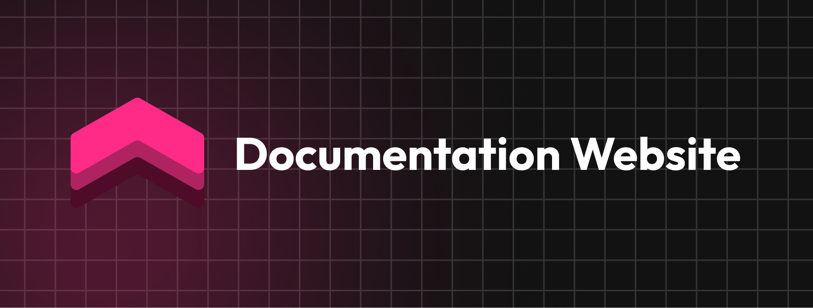

 
# 🚀 Welcome to Feedbase Docs

**Feedbase** is an open-source feedback platform designed specifically for product teams who want to listen, learn, and grow alongside their users.

---

## 📖 About this Repository

This repository contains the source code for the **Feedbase Landing Page** and our **official documentation**.

> **Note:** We are currently a work in progress! 🚧 We are actively building out our guides and refining our look, so please excuse the dust as we grow.

---

## 🛠 Tech Stack

We love keeping things clean, fast, and accessible. Our docs are powered by:

* **Framework:** Next.js (App Router)
* **Styling:** Tailwind CSS
* **Typography:** Inter, Plus Jakarta Sans, Outfit 
* **Deployment:** Vercel

---

## 🗺 Roadmap

We are building out the following sections to help your team succeed:

* [ ] **Getting Started:** Quick installation guide.
* [ ] **API Reference:** Integrating Feedbase into your product.
* [ ] **Best Practices:** How to manage and categorize user feedback effectively.
* [ ] **Customization:** Making Feedbase look like *your* brand.

---

## 🤝 Contributing

We love community contributions! Whether you’re fixing a typo, improving a guide, or suggesting a new feature, your help makes Feedbase better for everyone.

1. **Fork the repo.**
2. **Create a branch:** `git checkout -b feature/cool-new-doc`
3. **Make your changes.**
4. **Push to the branch:** `git push origin feature/cool-new-doc`
5. **Open a Pull Request!**

---

## ☕ Built in Portugal with ❤️ — Feedbase Team 🇵🇹

*Found a bug or want to suggest a feature?* Please [open an issue](https://www.google.com/search?q=https://github.com/breadddevv/feedbase/issues) and let us know!

---

*Made with love for the product community.*